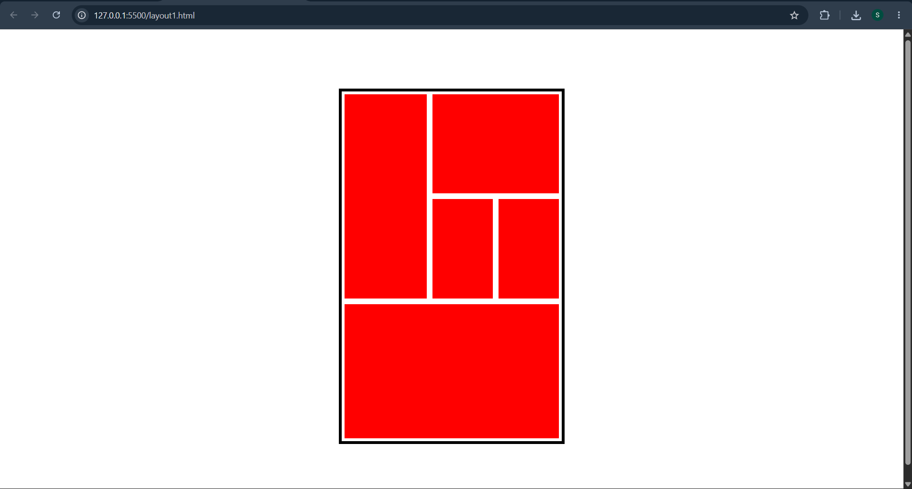
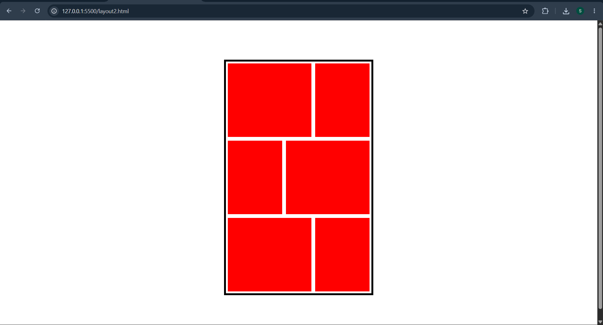
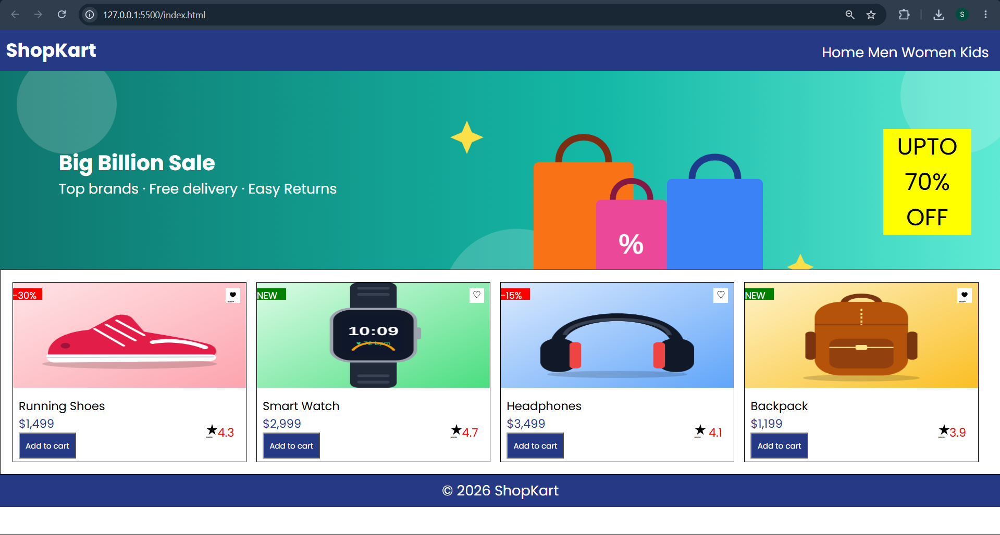

# Day 02 – HTML & CSS Practice

## Task 1: Layout Designs Using CSS Float

### Overview
Developed two simple grid-like layouts using the CSS Float property.

### Concepts Practiced
- CSS Float (`left` and `right`)
- CSS Box Model
- Percentage-based widths and heights
- Element alignment and positioning

### What I Learned
- Understood how `float: left` and `float: right` affect element positioning.
- Learned how to arrange multiple elements horizontally using CSS Float.
- Practiced creating structured layouts using percentage-based dimensions.
- Understood how borders and box sizing affect layout dimensions.

### Output

**Layout 1**

**Layout 2**

---

## Task 2: Shopping Website Landing Page – ShopKart

### Overview
Developed a shopping website landing page featuring a navigation bar, promotional banner, product cards, and footer.

### Concepts Practiced
- HTML Semantic Structure
- CSS Float
- CSS Positioning (`relative` and `absolute`)
- CSS Background Images
- CSS Box Model
- Element Alignment and Spacing

### What I Learned
- Understood how to use CSS positioning to place elements within product cards.
- Practiced creating product layouts using CSS Float.
- Learned how to apply background images and control their positioning and sizing.
- Implemented product badges, wishlist icons, pricing, ratings, and buttons.
- Improved my understanding of combining multiple CSS properties to build a complete webpage layout.

### Output

